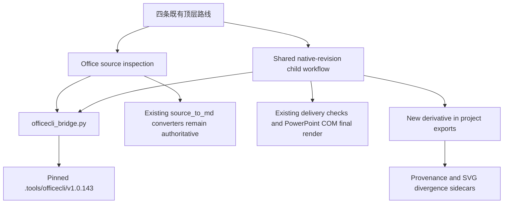

# OfficeCLI 深度集成 Agent Brief

> Status: approved implementation guide
> Authority: non-authoritative; AGENTS.md, SKILL.md, and owning workflows remain authoritative
> Implemented in: Not implemented
> Repository: `C:/Users/FUTIAN/Desktop/DeepPPT2`
> OfficeCLI baseline: `iOfficeAI/OfficeCLI v1.0.143`
> Prepared: 2026-08-04

---

## 0. 使用方式

本文件是 OfficeCLI 深度集成的完整实施契约，可直接交给后续开发 Agent。它批准的是本文列出的四个 Phase，不授权扩大范围、覆盖用户原件、发布、提交或推送。

执行时使用文末的“Execution Directive”。Agent 必须从 Phase 1 开始串行实施；每个 Phase 先建立同口径基线，再完成最小改动和规定验证。当前 Phase 未通过，不得进入下一 Phase。

创建、阅读或引用本文件不代表功能已经实现。运行规则只有在对应脚本、workflow、route authority、Dashboard 和 CI 实际修改并通过验证后才生效。

---

## 1. 目标与成功标准

### 1.1 目标

把 OfficeCLI 作为 DeepPPT2 的固定本地 Office 能力层，增强三类能力：

1. AI 可以读取原生 PPTX 对象树、格式、问题和稳定对象路径，并通过浏览器预览选择对象。
2. AI 可以对现有或已导出的 PPTX 做有计划、可确认、原子化、可回滚的原生修改与返工。
3. DOCX、XLSX、PPTX 源材料在进入现有转换流程时获得结构清单、问题报告和按需查询；DOCX/XLSX 修复只能显式启用并写入副本。

### 1.2 最终成功标准

| 目标 | 可验证结果 |
|---|---|
| 固定运行时 | 仓库只执行 `.tools/officecli/` 中校验和匹配且版本精确为 `1.0.143` 的二进制 |
| 原生查看 | PPTX 可生成结构化 inventory、HTML/截图预览，并返回用户选中的稳定对象路径 |
| 原生修改 | 一个已确认 plan 通过 OfficeCLI 默认原子 batch 应用到临时副本；任一操作失败时不发布产物 |
| 原件保护 | PPTX、DOCX、XLSX 的输入文件在所有成功和失败路径中 SHA-256 不变 |
| 原子回滚 | 失败 batch 的候选文件保持 batch 前字节一致；`exports/` 不出现失败候选 |
| 路由稳定 | 仍然只有 Generate / Create Template / Fill Native PPTX / Enhance Native PPTX 四条顶层路线 |
| 权威不反转 | SVG 生成、Markdown converters、template-fill、native-enhance 和 PowerPoint COM 继续拥有各自现有权威 |
| 可观测 | Dashboard、trace、quality report 能显示运行时、源检查、修订状态、验证结果和 SVG divergence |
| 跨平台 CI | Ubuntu CI 安装锁定二进制并跑契约 fixture；Windows 本地补 PowerPoint COM 最终视觉验证 |

---

## 2. 已锁定决策与已验证事实

以下决策已确认，实施 Agent 不得重新解释：

| 编号 | 决策 |
|---|---|
| D1 | OfficeCLI 是本仓 Office 文件能力的强制运行时依赖，不是可选“有则增强”路径 |
| D2 | 版本固定为 `v1.0.143`，安装到 gitignored `.tools/officecli/`；运行时不得静默使用 PATH 中的其他版本 |
| D3 | 保留四条顶层 PPT 路线；新增能力是共享的 `native-revision` 子工作流，不是第五条路线 |
| D4 | 集成分四阶段：运行时桥接、原生修订、源文件增强与修复、质量/Dashboard/CI |
| D5 | DOCX/XLSX 修复是 opt-in，始终在副本上执行；用户原件不可变 |
| D6 | 当前 SVG 生成管线和 `source_to_md` converters 继续作为生成与 Markdown 内容转换权威 |
| D7 | Python 只通过 OfficeCLI JSON CLI 调用，不注册 MCP，不接 SDK，不自动安装 plugins/skills |
| D8 | 生成项目默认回到 SVG 层修订；原生 PPTX 修改仅作为显式 last-mile derivative，并记录 SVG divergence |

截至 2026-08-04 已验证：

- 本机 OfficeCLI 版本为 `1.0.143`，同时是上游最新 release；release 发布时间为 2026-07-28。
- 上游许可证为 Apache-2.0。
- 六个现有 fixture/example PPTX 的 `officecli validate --json` 均为零错误，检查前后 SHA-256 不变。
- OfficeCLI 的 HTML/browser renderer 适合定位和交互预览，不取代 PowerPoint COM 的最终视觉裁决。
- 当前环境未安装 OfficeCLI plugins；`.doc`、`.xls` 等 legacy 格式继续走现有 Pandoc/PyMuPDF/既有 fallback，不在本次接管范围内。

这些事实是实施基线。若执行时上游状态变化，只报告变化；不得自动升级版本。

---

## 3. 目标架构与权威边界



### 3.1 Ownership

| Owner | 唯一职责 |
|---|---|
| `install_officecli.py` + lock manifest | 平台解析、下载、SHA-256 验证、原子安装、版本探测 |
| `officecli_bridge.py` | 二进制解析、无 shell 进程调用、JSON envelope、timeout、错误码和敏感信息边界 |
| `native_revision_pptx.py` | 原生修订项目、inventory、plan、preview/selection、apply、postflight 和 provenance |
| `office_source_inspect.py` | Office source 的只读结构增强与 `analysis/office_sources.json` |
| `office_source_repair.py` | DOCX/XLSX 修复 plan、复制、原子 apply、验证和 converter 对账 |
| `source_to_md/*.py` | Markdown 正文与现有格式恢复，保持权威 |
| `template_fill_pptx.py` | Fill Native PPTX 初始填充，保持权威 |
| `native_enhance_pptx.py` | notes/audio/timings/transitions，保持 append-oriented 权威 |
| SVG pipeline | 新生成 deck 和 canonical revision，保持权威 |
| `pptx_render_export.py` + PowerPoint | Windows 可用时的最终视觉真相 |
| Dashboard | 只读消费者和服务链接，不拥有 apply 或 schema |

### 3.2 不允许的权威反转

- OfficeCLI 不得替代 Strategist、Executor、SVG authoring、`svg_to_pptx.py` 或 `finalize_svg.py`。
- `office_sources.json` 是补充 inventory，不得替代 Markdown source 或 converter 输出。
- OfficeCLI `view html`、`watch`、HTML screenshot 是预览，不得标记为最终视觉通过。
- Dashboard 不得新增“直接应用修订”的写接口；plan 确认和 apply 仍由 owning CLI/workflow 执行。
- `raw-set`、`add-part` 不进入 V1 公共 plan；现有特定 OOXML writer 继续拥有其领域。

---

## 4. 固定运行时与供应链契约

### 4.1 跟踪文件与本地布局

新增跟踪文件：

```text
skills/ppt-master/scripts/assets/officecli-lock.json
skills/ppt-master/scripts/install_officecli.py
skills/ppt-master/scripts/officecli_bridge.py
```

新增 gitignore 规则：

```text
.tools/officecli/
```

本地安装布局固定为：

```text
.tools/officecli/v1.0.143/<platform>/officecli[.exe]
```

不得提交二进制、下载缓存、watch session 或临时修订副本。

### 4.2 Lock manifest

`officecli-lock.json` 使用 `ppt_master.officecli_lock.v1`，至少包含：

- 精确版本 `1.0.143`。
- GitHub repository、tag、release URL、Apache-2.0 license URL。
- 平台键、release asset 名、下载 URL、SHA-256。
- 可执行文件名和安装相对路径。

锁定校验和：

| Platform key | Release asset | SHA-256 |
|---|---|---|
| `windows-x86_64` | `officecli-win-x64.exe` | `d4d4c10fced307e209744cf98a56b003a6e613424fd651b08469274704afd2c6` |
| `windows-arm64` | `officecli-win-arm64.exe` | `51baf511fe136ee216fcc13cf0da9d18078da42212b22805c3a81f4163a4d7b9` |
| `linux-x86_64` | `officecli-linux-x64` | `6a29c598a789b57c92c03e560907d3f131a4bd0a068785b1d338a86fc31a58a7` |
| `linux-arm64` | `officecli-linux-arm64` | `c50298e4698fcd1b15fe1a0f096405ad260b5c84d4440882582d0bba1e57bd49` |
| `linux-alpine-x86_64` | `officecli-linux-alpine-x64` | `6bdae606e4fd1b31da1b75f5e6e0280ee4cf203059c8844c15ec7a5cc200e6bb` |
| `linux-alpine-arm64` | `officecli-linux-alpine-arm64` | `3445c0992d4c746ed55606b30d366fc936ed87eed0cddbc18f0c0dfa40cf8cee` |
| `darwin-x86_64` | `officecli-mac-x64` | `693d243db616c74705fec9d92fdfc8a3db36acfcea378edb7264c2a30d339d9c` |
| `darwin-arm64` | `officecli-mac-arm64` | `2f158d46f9b6c5eb0dfe4eb02038114001e17acc47b67347417c56dcf9659096` |

### 4.3 Installer CLI

公共命令固定为：

```powershell
python skills/ppt-master/scripts/install_officecli.py install --json
python skills/ppt-master/scripts/install_officecli.py check --json
python skills/ppt-master/scripts/install_officecli.py path --json
```

实现约束：

1. 只使用 Python 标准库下载，不执行上游 shell/PowerShell install pipe。
2. 下载到 `.tools/officecli/.downloads/` 的唯一临时文件，流式计算 SHA-256。
3. 校验通过后设置 Unix execute bit，再用同卷原子 rename 发布到版本目录。
4. 发布前运行 `--version`，输出必须精确为 `1.0.143`。
5. 校验失败、版本不符、平台不支持或下载中断时，删除未发布临时文件并返回非零。
6. `check` 不联网、不修改文件；缺失时给出唯一修复命令。
7. 默认平台自动探测；Alpine 只根据 musl 环境选择，不允许把 glibc asset 猜成 Alpine asset。
8. 不读取 PATH 中的 `officecli` 作为成功结果；可在诊断中报告其存在，但不得执行它。

### 4.4 升级规则

OfficeCLI 升级必须是独立变更：更新 lock、逐平台 SHA、license/release 证据、契约 fixture 和变更记录。禁止使用 `latest` URL、宽松 semver 或运行时自动更新。

---

## 5. `officecli_bridge.py` 契约

### 5.1 公共接口

桥接层保持小而明确，提供以下 typed API：

```python
resolve_officecli() -> Path
probe_officecli() -> OfficeCliRuntime
run_officecli(args: Sequence[str], *, input_json: object | None = None,
              timeout_s: float = 60.0) -> OfficeCliResult
run_atomic_batch(file: Path, commands: Sequence[Mapping[str, object]], *,
                 timeout_s: float = 120.0) -> OfficeCliResult
validate_office_file(file: Path) -> OfficeCliResult
inspect_office_file(file: Path, *, detail: str = "summary") -> dict[str, object]
```

具体类名可以匹配仓库风格，但职责、返回字段和错误语义不得改变。

`OfficeCliRuntime` 至少返回 `path`、`expected_version`、`actual_version`、`platform`、`sha256`、`status`。`OfficeCliResult` 至少返回 `success`、`returncode`、`data`、`message`、`duration_ms`、`error_code`；不得把完整源内容或 mutation props写入 trace。

### 5.2 进程与 JSON 规则

- 始终以 argv list 调用 `subprocess`，禁止 `shell=True` 和拼接 command string。
- 机器调用必须附加 `--json`；stdout 必须解析为 OfficeCLI envelope。
- `returncode != 0`、JSON 无法解析、`success != true` 任一成立即失败。
- batch commands 通过 stdin JSON 传入，不使用 `--commands` 暴露大段文本或引号敏感内容。
- 非 watch 操作设置 `OFFICECLI_NO_AUTO_RESIDENT=1`，保证独立进程、及时落盘和无遗留锁。
- watch 是唯一允许的长驻路径，由 `native_revision_pptx.py watch/unwatch` 管理 PID、port 和退出。
- 命令 timeout 后终止子进程，返回稳定错误码；不得继续使用未知状态候选。
- 路径必须 resolve 后位于仓库、显式用户输入文件或已批准的 project root；临时删除只能针对已验证的 repo `.tmp/officecli-*`。
- stderr 只用于诊断并做长度限制；日志不得包含源正文、replacement 文本、凭据或完整 batch。

### 5.3 稳定错误码

至少实现：

```text
OFFICECLI_NOT_INSTALLED
OFFICECLI_VERSION_MISMATCH
OFFICECLI_CHECKSUM_MISMATCH
OFFICECLI_UNSUPPORTED_PLATFORM
OFFICECLI_TIMEOUT
OFFICECLI_INVALID_JSON
OFFICECLI_COMMAND_FAILED
OFFICECLI_PLAN_INVALID
OFFICECLI_PLAN_STALE
OFFICECLI_TARGET_MISSING
OFFICECLI_BATCH_ROLLED_BACK
OFFICECLI_VALIDATION_FAILED
OFFICECLI_PREVIEW_UNAVAILABLE
OFFICECLI_VISUAL_REVIEW_REQUIRED
```

调用方不得解析英文 message 决定流程。

---

## 6. Shared `native-revision` 子工作流

### 6.1 入口与产物

新增：

```text
skills/ppt-master/scripts/native_revision_pptx.py
skills/ppt-master/workflows/stages/native-revision.md
```

CLI 契约：

```powershell
python skills/ppt-master/scripts/native_revision_pptx.py init <pptx-or-project> [--name <slug>]
python skills/ppt-master/scripts/native_revision_pptx.py inspect <project>
python skills/ppt-master/scripts/native_revision_pptx.py watch <project> [--port 26315]
python skills/ppt-master/scripts/native_revision_pptx.py selected <project> --json
python skills/ppt-master/scripts/native_revision_pptx.py unwatch <project>
python skills/ppt-master/scripts/native_revision_pptx.py check-plan <project>
python skills/ppt-master/scripts/native_revision_pptx.py apply <project>
python skills/ppt-master/scripts/native_revision_pptx.py validate <project> --pptx <candidate>
```

如果输入是现有 PPT Master project，修订 sidecars 写回该 project，但不改变原 `project.json` kind。若输入是独立 PPTX，`init` 创建 `native_pptx_revision` project 并把原件复制到 `sources/`，不得 move。

项目产物：

```text
analysis/native_revision_inventory.json
analysis/native_revision_plan.json
analysis/native_revision_result.json
quality/officecli_validation.json
validation/native_revision_report.json
native_preview/officecli-watch.json
exports/<stem>_native_revision_<timestamp>.pptx
```

### 6.2 查看与选择

`inspect` 组合以下只读信息：

- `view outline --json`、`view stats --json`、`view issues --json`。
- 按页、按需调用 `get '/slide[N]' --depth N --json`，保留 `@id=` / `@name=` stable path。
- slide、shape、picture、table、chart、connector、group、notes、transition 和 animation presence 的摘要。
- source SHA-256、slide roster、master/layout/theme 和现有 motion fingerprints。

不得默认 dump 全部 raw XML。大 deck 的 inventory 必须分页/限深，详细对象只在用户或 Agent 指定页时加载。

`watch` 启动 OfficeCLI 本地预览，并把实际 URL、port、PID、source hash 和启动时间写入 lock sidecar。浏览器选择通过 `get <file> selected --json` 返回稳定 path；selection 只帮助起草 plan，不代表用户已确认修改。

### 6.3 原子 plan schema

`analysis/native_revision_plan.json` 使用 `ppt_master.native_revision_plan.v1`。最小结构：

```json
{
  "schema": "ppt_master.native_revision_plan.v1",
  "status": "draft",
  "officecli_version": "1.0.143",
  "source": {
    "path": "exports/deck.pptx",
    "sha256": "<lowercase-sha256>",
    "slide_count": 12,
    "origin": "generated_export"
  },
  "operations": [
    {
      "id": "R001",
      "command": "set",
      "path": "/slide[2]/shape[@id=7]",
      "props": {"text": "修订后的文字"},
      "expect": {"type": "textbox", "text": "修订前的文字"},
      "reason": "按用户批注修正文案"
    }
  ],
  "invariants": {
    "preserve_slide_count": true,
    "preserve_masters": true,
    "preserve_unaddressed_objects": true,
    "allow_svg_divergence": true
  },
  "confirmation": {
    "confirmed_at": null,
    "confirmed_by": null
  }
}
```

规则：

1. `status` 只允许 `draft`、`confirmed`、`applied`、`failed`。
2. `apply` 只接受显式确认后的 `confirmed` plan。
3. V1 mutation allowlist 是 `set`、`add`、`remove`、`move`、`swap`；拒绝 `raw-set`、`add-part`、`import`、`merge`、`--best-effort` 和任意未知字段。
4. 可寻址 PPT 对象必须优先使用稳定 `@id=` 或 `@name=` path。位置 path 只能用于没有稳定 ID 的子节点，并必须有 `expect` fingerprint。
5. 每个 mutation 必须有 `id`、`reason` 和可验证 `expect`；`add` 验证 parent，其他 mutation 验证 target。
6. `check-plan` 重新读取 source，校验 source hash、slide roster、target、expect、allowlist 和 plan schema。
7. `props` 只进入临时 batch stdin，不进入 trace、Dashboard summary 或异常全文。
8. 对 slide add/remove/reorder、master/layout/theme、animation、OLE/SmartArt/3D 等高影响操作，V1 默认拒绝；只有后续独立 capability contract 才能开放。

### 6.4 Apply 事务

`apply` 必须执行：

1. 运行 runtime probe 和 `check-plan`。
2. 在 repo-local `.tmp/officecli-<run-id>/` 创建 source 的字节副本并记录 SHA-256。
3. 对临时副本执行 OfficeCLI 默认 atomic batch；禁止 `--best-effort`。
4. 若任一 item 失败，确认 `atomicRolledBack: true` 或候选 SHA 与 batch 前一致，返回非零且不写 `exports/`。
5. batch 成功后运行 `officecli validate --json`，再运行 DeepPPT2 delivery/OPC/quality checks。
6. 对比 source 与 candidate 的 slide roster、未寻址对象、master/layout、hidden state、transition/animation fingerprints；只允许 plan 声明的差异。
7. Windows + PowerPoint 可用时调用 `pptx_render_export.py` 生成最终 PNG；浏览器 preview 不得替代该步骤。
8. 全部门通过后才以原子 rename 发布新的 timestamped PPTX 到 `exports/`。
9. 写 result、validation、trace 和 provenance；关闭 watch/resident，清理已验证 temp 路径。

任何失败均保留原件和之前的成功 export。失败候选不得成为 `latest_pptx`。

### 6.5 SVG divergence

当 source `origin == generated_export` 时：

- `analysis/native_revision_result.json` 必须记录 base PPTX SHA、SVG/spec digest、plan digest、output SHA 和 `svg_divergence: true`。
- Dashboard 明确标识“原生派生版已偏离 SVG canonical source”。
- 后续普通内容/版式返工默认回到 SVG 修改并重新导出。
- 只有用户再次明确要求 last-mile native edit 时，才在最新已验证 derivative 上继续。
- 不实现 PPTX 到 SVG 的反向同步，也不把 native derivative 写回 `svg_output/`。

---

## 7. Office source 增强与副本修复

### 7.1 `analysis/office_sources.json`

新增 `office_source_inspect.py`，并在 `project_manager.py import-sources` 成功归档 `.docx`、`.xlsx`、`.pptx` 后调用。schema 为 `ppt_master.office_sources.v1`：

```json
{
  "schema": "ppt_master.office_sources.v1",
  "officecli": {"version": "1.0.143", "status": "ready"},
  "sources": [
    {
      "path": "sources/source.docx",
      "sha256": "<lowercase-sha256>",
      "format": "docx",
      "status": "passed",
      "summary": {
        "sections": 2,
        "tables": 4,
        "images": 7,
        "comments": 1,
        "issues": 0
      },
      "outline": [],
      "issues": [],
      "converter": {
        "authority": "source_to_md/doc_to_md.py",
        "markdown": "sources/source.md"
      },
      "repair": null
    }
  ]
}
```

实际字段按 format 区分，但必须保持单一 manifest、稳定 schema 和相对路径。PPTX 记录 slide/object/notes/chart/table/media 摘要；DOCX 记录 section/paragraph/table/image/comment/revision/equation 摘要；XLSX 记录 sheet/range/formula/table/chart/pivot/validation 摘要。

规则：

- inspection 是只读的，检查前后断言 source SHA 不变。
- manifest 可包含有限 outline 和 issue metadata，不复制全文、raw XML、完整公式数据集或个人信息到 trace。
- `source_to_md` 输出继续承载正文；Agent 在 Strategist 之前读取 manifest 发现复杂结构和 converter 风险。
- OfficeCLI 缺失、版本不符会阻断 Office-backed intake；普通 Markdown/PDF/URL 路径不因此启动 OfficeCLI。
- OfficeCLI 报告源结构问题时记录 warning/failed；不得静默修复，也不得把 OfficeCLI 文本提取替换为 converter 输出。
- `.doc`、`.xls`、受密码保护文件和依赖 plugins 的格式保持现有路径，并标记 unsupported enrichment。

### 7.2 DOCX/XLSX copy-only repair

新增 `office_source_repair.py`，公共命令：

```powershell
python skills/ppt-master/scripts/office_source_repair.py scaffold <project> --source <relative-path>
python skills/ppt-master/scripts/office_source_repair.py check-plan <project>
python skills/ppt-master/scripts/office_source_repair.py apply <project>
```

`analysis/source_repair_plan.json` 使用 `ppt_master.office_source_repair_plan.v1`，沿用 native plan 的 source hash、status、operations、expect、confirmation 和 invariants。仅允许 DOCX/XLSX 对应的 L2 DOM mutation；禁止 raw XML 和 plugin 命令。

Apply 规则：

1. 用户必须明确确认修复内容和使用修复副本作为后续 source。
2. 原件永远不打开为 mutation target；先复制到 `.tmp/officecli-<run-id>/`。
3. 对副本执行 atomic batch、OfficeCLI validate、issues readback 和 source SHA 对账。
4. 成功后发布到 `<project>/sources/repaired/<stem>_repaired_<timestamp>.<ext>`。
5. 重新运行原 converter，将结果写成新的 Markdown，不覆盖旧 Markdown。
6. 写 `analysis/source_repair_result.json`，记录 original/repaired/Markdown hash、operation digest、issues delta 和 converter warnings。
7. 只有用户已选择修复副本时，后续 pipeline 才读取它；否则原归档 source 仍是 canonical input。

自动“修复所有 issues”、静默格式标准化、公式重算、tracked changes 接受/拒绝和删除内容均不在默认行为中。

---

## 8. 四路由接入矩阵

不得增加顶层 route。更新 `AGENTS.md`、`SKILL.md`、`routing.md`、`workflows/index.md` 和 owning workflows 时，按下表接入：

| Top-level route | Office source inspection | Native revision | 保持不变的 owner |
|---|---|---|---|
| Generate PPTX | Step 1/2 对 Office sources 写 `office_sources.json`；converter 仍产出 Markdown | Step 7 导出后，仅用户明确要求 last-mile edit 时进入 shared child；默认返工仍走 SVG revision | Strategist、Executor、SVG quality/export |
| Create Template | 只读分析 PPTX/DOCX/XLSX reference，帮助识别 theme/master/layout/object inventory | 不修改 reference；只有独立生成的 review export 可在明确要求时产生 derivative | `create-template.md` / `create-brand.md` |
| Fill Native PPTX | 检查 raw template 和新 Office materials，manifest 作为 fill-plan 辅助 | `template_fill_pptx.py apply` 成功后可修订其 export；不得绕过 fill plan 直接重做初始填充 | `template_fill_pptx.py` |
| Enhance Native PPTX | 检查 finished source 和 package issues | 可见对象修改由 shared child；notes/audio/timings/transitions 仍由 native-enhance core。两类请求同时存在时，先 native revision，再以 copy-only handoff 运行 enhance | `native_enhance_pptx.py` 和 shared audio rules |

路由 discriminator 增补但不扩容：

- “改现有 PPT 里的文字/颜色/位置/对象，同时保留原生格式”进入 Enhance Native PPTX lifecycle，再调用 `native-revision` child。
- “重新设计、拆页、合页、换结构”仍进入 Generate PPTX，不允许用 OfficeCLI 规避 SVG 流程。
- “把新内容填回模板壳”仍进入 Fill Native PPTX。
- “只加备注/配音/时序/转场”仍直接使用现有 Enhance Native PPTX core。

修改 `SKILL.md` 时按仓库规则保留 `[NEEDS_HUMAN_REVIEW]` 标记。任何摘要文档只能链接新 workflow，不能复制成第二套权威规则。

---

## 9. 验证、质量与可观测性

### 9.1 Gate 顺序

| 顺序 | Gate | 失败行为 |
|---|---|---|
| 1 | Pinned runtime/version/checksum | 阻断 Office-backed 操作，不进入 mutation |
| 2 | Source hash、plan schema、target/expect | 阻断，错误码稳定，原件不变 |
| 3 | OfficeCLI atomic batch | 任一 item 失败即 rollback，不发布 |
| 4 | `officecli validate --json` | mutation 路径阻断；source inspection 记录问题但不自动修复 |
| 5 | DeepPPT2 OPC/delivery validation | 不允许 candidate 新增 structural error |
| 6 | `pptx_quality_check.py` baseline delta | 任意新 error 阻断；legacy warning 只要未增加可保留并说明 |
| 7 | PowerPoint COM render | Windows 可用时为最终视觉门；不可用时标记 `visual_review_required`，不得声称最终视觉通过 |
| 8 | Readback/provenance/hash | 全部一致后才能发布 export |

对于任意第三方 native PPTX，质量比较使用 source baseline 与 candidate delta，不能用 Generate-route 的绝对阈值误杀历史 deck。

### 9.2 Quality artifacts

`quality/officecli_validation.json` 使用 `ppt_master.officecli_validation.v1`，至少包含 runtime、source/candidate hash、command status、schema validation、issues summary、baseline delta、DeepPPT2 gate refs 和 final status。

`validation/native_revision_report.json` 记录 plan/result digests、允许差异、实际差异、未寻址对象保护、visual render 状态和 publish path。报告不得复制 replacement 正文。

### 9.3 Trace

复用 `dashboard/trace_writer.py` envelope，增加稳定 operation：

```text
officecli_probe
office_source_inspect
native_revision_inspect
native_revision_preview
native_revision_plan
native_revision_apply
office_source_repair
officecli_validate
```

事件只记录 version、format、对象/操作数量、status、duration、error code、相对 artifact path 和 output hash。禁止记录源正文、plan props、replacement 文本、raw XML、URL query、凭据或完整 CLI argv。

### 9.4 Dashboard

在现有只读 Dashboard state 中增加：

- `officecli_runtime`：expected/actual version、platform、checksum、ready/error。
- `office_sources`：各 source format、inspection status、结构计数、issues 和 repair derivative。
- `native_revision`：base/output、plan status、operation count、preview URL、selection count、validation 和 SVG divergence。
- quality/artifact reader 对新 JSON sidecar 的只读展示。

Dashboard 只展示 OfficeCLI watch 的实际 URL 和状态，不代理 mutation、不保存 plan、不充当确认 gate。服务停止时必须结束 watch 并清理 stale lock；不得留下后台 session。

---

## 10. 分阶段实施

### Phase 1 - Pinned Runtime and Bridge

目标：建立唯一、可验证、跨平台的 OfficeCLI 调用层，不接入业务 mutation。

修改范围：

- `.gitignore`
- `skills/ppt-master/scripts/assets/officecli-lock.json`
- `skills/ppt-master/scripts/install_officecli.py`
- `skills/ppt-master/scripts/officecli_bridge.py`
- 对应 script docs、安装文档、smoke contract、`docs/change-log.md`

步骤与验证：

| ID | 实施 | 验证 |
|---|---|---|
| P1.1 | 记录 guard、完整 smoke、Python/OS 和当前 git status 基线 | 命令、rc、passed/failed/skipped 可复核 |
| P1.2 | 写 lock 和 installer | 各平台映射完整；当前平台 install/check/path JSON 通过 |
| P1.3 | 写 bridge 和稳定错误码 | valid JSON、invalid JSON、non-zero、timeout、wrong version characterization 通过 |
| P1.4 | 对六个既有 PPTX 运行 bridge validate | 全部通过且每个 source SHA 前后一致 |
| P1.5 | 更新最小文档和 smoke | 新入口 import 无副作用、`--help` 成功、错误路径 rc 非零 |

Phase 1 gate：runtime 只能从 pinned path 解析；checksum/version 负例 fail closed；guard、smoke、integration smoke 全绿。未通过不得接入 project manager 或 workflow。

### Phase 2 - Native PPTX Inspection and Revision

目标：交付可预览、可选择、可确认、原子 apply 的原生 PPTX 修订子工作流。

修改范围：

- `native_revision_pptx.py`
- `workflows/stages/native-revision.md`
- routing/index/SKILL/AGENTS 和三个消费 route 的最小接线
- synthetic native-revision fixture、script docs、change log

步骤与验证：

| ID | 实施 | 验证 |
|---|---|---|
| P2.1 | 创建 3-5 页 synthetic PPTX fixture，包含 text/table/chart/picture/group 和 stable IDs | rebuild script 可重复；无用户/受限内容 |
| P2.2 | 实现 init/inspect/watch/selected/unwatch | inspect 前后 SHA 一致；watch URL 可访问；selection 返回 stable path |
| P2.3 | 实现 schema 和 check-plan | stale source、missing target、expect mismatch、未知 command 均非零 |
| P2.4 | 实现 temp-copy atomic apply | 成功只产生新 export；原件 SHA 不变 |
| P2.5 | 注入一个中途失败的两项 batch | 整批 rollback；候选 hash 不变；无 export |
| P2.6 | 接入 postflight、COM render 和 divergence | 允许差异精确；未寻址对象无变化；生成来源标记 divergence |
| P2.7 | 接入四路由但不增加 route | routing regression 明确只有四条 top-level route |

Phase 2 gate：成功/失败/过期/目标漂移/预览 lifecycle fixtures 全过；PowerPoint 可用机上实际 render 无阻断缺陷；所有 source 和已有 export 不被覆盖。

### Phase 3 - Office Source Enrichment and Copy Repair

目标：提升 Office 源文件结构理解，并提供显式、副本式 DOCX/XLSX 修复。

修改范围：

- `office_source_inspect.py`
- `office_source_repair.py`
- `project_manager.py` 的 Office-source intake hook
- `source_to_md` 消费说明，不改其内容权威
- DOCX/XLSX/PPTX synthetic fixtures、script docs、change log

步骤与验证：

| ID | 实施 | 验证 |
|---|---|---|
| P3.1 | 写 versioned `office_sources.json` | 多 source 合并稳定、相对路径、hash 和 format-specific counts 正确 |
| P3.2 | project import 接入只读 inspect | Office source 会写 manifest；MD/PDF/URL 不启动 OfficeCLI |
| P3.3 | 用现有 complex DOCX/PPTX 与新增 XLSX fixture 对账 | table/image/chart/formula/note 等关键计数匹配 |
| P3.4 | 写 repair plan/check/apply | 未确认拒绝；原件永远不作 mutation target |
| P3.5 | 成功 repair 后重跑原 converter | 新 Markdown 与 repaired hash 有 provenance；旧 Markdown 不覆盖 |
| P3.6 | 注入 atomic failure 和 converter warning | 无修复副本发布或明确 warning；原件 SHA 不变 |

Phase 3 gate：源 inspection 无 mutation；repair 只产生 timestamped copy；用户未选择副本时 pipeline 不切换 source；legacy/plugin 格式没有伪支持。

### Phase 4 - Quality, Dashboard, Trace and CI

目标：把前三阶段接入统一质量门和日常回归，而不是留下孤立工具。

修改范围：

- Dashboard state/artifact/quality readers 与前端只读展示
- trace/run summary 消费
- `pptx_delivery_check.py` / `pptx_quality_check.py` 的 baseline-delta 组合层，不做无关重构
- `smoke_check.py` integration contracts
- `.github/workflows/ci.yml`
- final docs、change log、attribution guard 关键入口清单复核

步骤与验证：

| ID | 实施 | 验证 |
|---|---|---|
| P4.1 | 写统一 validation/provenance artifacts | schema、null/0、hash、error code 语义稳定 |
| P4.2 | 接入 trace 且做敏感字段负测 | trace 不含 source text、props、raw XML、credentials |
| P4.3 | Dashboard 展示 runtime/source/revision/divergence | `/api/state` 契约通过；不存在写入 apply endpoint |
| P4.4 | CI 用 installer 下载 Linux pinned binary | checksum/version 通过；不得依赖 runner PATH |
| P4.5 | CI 跑 inspect/validate/atomic success/rollback fixtures | Ubuntu 全绿；COM-only 测试明确 skip，不伪装通过 |
| P4.6 | 跑全仓回归和文档/路由检查 | 四路由、guard、smoke、integration、目标 E2E 全绿 |

Phase 4 gate：本地 Windows 与 Ubuntu CI 证据齐全；Dashboard/trace 无敏感内容；所有 public commands、schemas、workflows 和安装说明一致。

---

## 11. Fixture、CI 与验收矩阵

### 11.1 Fixture 原则

- 放在 `skills/ppt-master/fixtures/officecli/`，全部 synthetic、非敏感、可 rebuild。
- 二进制 fixture 附 README、来源、许可证、预期 SHA 和 rebuild command。
- mutation 测试复制到 repo `.tmp/officecli-*`；禁止直接写 tracked fixture。
- 不在 `projects/` 创建开发试验；如现有代码强制 project layout，使用 `_smoke_` 前缀并在结束前停止服务、清理。

### 11.2 必须覆盖

| Case | 预期 |
|---|---|
| Installer happy path | exact version/checksum/path，重复安装幂等 |
| Corrupted download | checksum mismatch，未发布 binary |
| Wrong local version | fail closed，不回退 PATH |
| Read-only PPTX inspection | inventory 正确，input SHA 不变 |
| Stable selection | browser selection 返回 `@id=` path |
| Atomic success | 目标修改正确，新 export 发布 |
| Atomic partial failure | `atomicRolledBack`，无 export，candidate/source hash 不变 |
| Stale plan | source hash 或 target fingerprint 漂移即拒绝 |
| Unaddressed preservation | 未寻址对象、masters/layouts/motion fingerprints 不变 |
| Generated derivative | result 和 Dashboard 都显示 `svg_divergence: true` |
| DOCX/XLSX inspect | 关键结构计数与 fixture ledger 一致 |
| Repair without confirmation | 非零，无 mutation |
| Repair success | 只新增 repaired copy + new Markdown，original hash 不变 |
| Legacy/plugin format | 显式 unsupported enrichment，继续现有 route，不自动安装 plugin |
| Trace privacy | replacement/source/raw XML 不出现在 trace/run summary |
| No COM environment | 明确 skip/visual-review-required，不声称最终视觉通过 |

### 11.3 最终命令集

实施 Agent 必须报告每条命令的 rc 和关键计数：

```powershell
python skills/ppt-master/scripts/attribution_guard.py
python skills/ppt-master/scripts/install_officecli.py install --json
python skills/ppt-master/scripts/install_officecli.py check --json
python skills/ppt-master/scripts/smoke_check.py --skip-help
python skills/ppt-master/scripts/smoke_check.py
python skills/ppt-master/scripts/smoke_check.py --integration
```

另运行 native revision、source inspection、source repair 的全部 fixture command；Windows + Office 环境运行：

```powershell
python skills/ppt-master/scripts/pptx_render_export.py --pptx <candidate.pptx> -o <render-dir>
```

对涉及完整 PPT project 的 fixture 再运行适用的 `pptx_delivery_check.py`、`pptx_quality_check.py`、`e2e_validate.py`。不得把不适用于 native arbitrary deck 的 Generate-only gate 强行当绝对门。

---

## 12. 安全、失败恢复与回滚

### 12.1 文件安全

- 所有 mutation 以 byte copy 为起点；任何命令都不接受 `--in-place` 或 source=output。
- 发布使用 timestamped filename 和原子 rename；默认拒绝覆盖已有文件。
- 清理前 resolve `.tmp/officecli-<run-id>` 的绝对路径并验证位于 repo `.tmp/`。
- PowerPoint/WPS 正在打开 target 时先失败并提示关闭，不尝试抢锁。
- 不打印 `.env`、凭据、用户全文或浏览器 session。

### 12.2 失败恢复

| 失败 | 恢复行为 |
|---|---|
| Runtime/版本/校验和失败 | 不打开 Office source，返回 installer/check 唯一命令 |
| Inspect 失败 | 保留 source，写失败状态；不得生成伪 inventory |
| Plan stale/target missing | 不创建 candidate；重新 inspect 和重新确认 plan |
| Batch item 失败 | 验证 rollback，丢弃临时候选，不写 export |
| Postflight 失败 | candidate 不发布；报告具体 gate 和差异 |
| COM 不可用 | 保留结构验证结果，标记需要视觉复核；不降级为 HTML 最终通过 |
| Dashboard/watch 中断 | workflow 仍可用 CLI；停止 stale PID/port，禁止 apply 受 Dashboard 影响 |

### 12.3 版本回滚

`v1.0.143` 是当前已知好版本。上游升级发生回归时，通过恢复上一份 reviewed lock 和本地版本目录回滚；不得动态拉取其他版本。每个成功 native revision 都保留 base/output hash，可直接交付前一个成功 export，不需要逆向撤销 OOXML。

---

## 13. 明确排除范围

- 不把 OfficeCLI 变成第五条顶层路线。
- 不用 OfficeCLI 替代 SVG 生成、现有 Markdown converters、template-fill 或 native-enhance writers。
- 不在 V1 开放 raw XML、master/layout/theme、对象动画、OLE、SmartArt、3D 或 slide reorder mutation。
- 不实现 PPTX 原生修改到 SVG 的反向同步。
- 不自动修复 DOCX/XLSX，不自动接受 tracked changes，不自动重算或改写公式。
- 不自动安装 OfficeCLI MCP、skills、plugins，不启动外部 telemetry。
- 不宣称 `.doc`、`.xls`、受密码保护文件或 plugin-only 格式得到新支持。
- 不把 browser HTML/screenshot 当 PowerPoint 最终渲染。
- 不执行付费 API、发布、部署、commit、push 或用户文件清理。
- 不做与本集成无关的脚本重构、全仓格式化、目录迁移或测试框架重建。

---

## 14. 假设与停止条件

### 14.1 假设

- 首次安装时可以访问 GitHub release；安装后 OfficeCLI 核心能力离线运行。
- 支持平台限于 lock manifest 的 Windows/Linux/macOS x64/arm64 资产。
- Windows 最终视觉验证机器安装可自动化的 Microsoft PowerPoint；其他平台只跑结构/契约门。
- OfficeCLI `v1.0.143` 的 JSON envelope、atomic batch 和 stable PPT path 行为与已验证命令一致。
- 用户要求“原生修改”时接受输出是新 derivative，而不是覆盖原件。

### 14.2 必须停止并说明

- 上游 release checksum 与本文/lock 不一致。
- 实施需要新增第五条 route、替换 converter/SVG authority 或修改用户原件。
- OfficeCLI 在已验证 fixture 上出现非确定性 mutation、不能证明 atomic rollback 或破坏未寻址对象。
- 需要打开 V1 明确排除的 raw XML/master/animation 能力才能完成基础功能。
- 现有 dirty worktree 与目标文件重叠且无法在保留用户改动的前提下实施。
- 修改后的 Phase baseline 出现无法归因的既有失败。

停止时给出证据、影响、推荐最小方案；不得用静默 fallback 绕过。

---

## 15. 文件落点清单

计划新增：

```text
skills/ppt-master/scripts/assets/officecli-lock.json
skills/ppt-master/scripts/install_officecli.py
skills/ppt-master/scripts/officecli_bridge.py
skills/ppt-master/scripts/native_revision_pptx.py
skills/ppt-master/scripts/office_source_inspect.py
skills/ppt-master/scripts/office_source_repair.py
skills/ppt-master/workflows/stages/native-revision.md
skills/ppt-master/fixtures/officecli/
```

计划最小修改：

```text
.gitignore
AGENTS.md
skills/ppt-master/SKILL.md
skills/ppt-master/workflows/routing.md
skills/ppt-master/workflows/index.md
skills/ppt-master/workflows/generate-pptx.md
skills/ppt-master/workflows/create-template.md
skills/ppt-master/workflows/template-fill-pptx.md
skills/ppt-master/workflows/native-enhance-pptx.md
skills/ppt-master/scripts/project_manager.py
skills/ppt-master/scripts/smoke_check.py
skills/ppt-master/scripts/dashboard/
skills/ppt-master/scripts/README.md
skills/ppt-master/scripts/docs/
.github/workflows/ci.yml
docs/change-log.md
```

安装类用户文档只更新实际受影响页面。不得因为这张候选清单批量触碰所有文件；每一行 diff 必须追溯到当前 Phase 的验收目标。

计划文件本身不写入 `docs/change-log.md`。只有实际修改 scripts/workflows/routes/CI 时，才按仓库规则记录实施变更。

---

## 16. Phase 回执格式

每个 Phase 完成时提交一个简短回执：

```text
Phase: <1-4>
Baseline: <commands and rc>
Changed: <exact files>
Contracts: <public CLI/schema/route changes>
Verified: <commands, rc, pass/fail/skip counts>
Immutability: <source hashes before/after>
Residual risks: <none or explicit list>
Next: <next Phase or stop reason>
```

不得只说“测试通过”；必须给命令、退出码和关键计数。不得把 skipped COM test 写成 passed。

---

## 17. Execution Directive

把下面整段作为下一位实施 Agent 的指令：

```text
请严格执行 plans/officecli-deep-integration-agent-brief.md，从 Phase 1 开始按阶段实施。先完整读取 AGENTS.md、.align/lessons.md、.align/spec.md、.align/context.md、skills/ppt-master/SKILL.md 和当前 Phase 的 owning rules/workflows，并先运行 attribution_guard 与同口径 smoke baseline。

每次只实施当前 Phase 的最小范围：完成代码、schema、workflow、fixture、文档和规定验证，提交 Phase 回执；当前 Phase 全部通过后再进入下一 Phase。保持四条顶层路线，不得新增第五条 route，不得替换 SVG pipeline、source_to_md converters、template-fill、native-enhance 或 PowerPoint COM 的既有权威。

OfficeCLI 必须固定为 repo-local v1.0.143，严格验证 lock 中的 SHA-256；禁止 PATH fallback、MCP/SDK、plugins、自动升级和 shell command 拼接。所有 mutation 必须在临时副本上使用默认 atomic batch，禁止 --best-effort；任何失败不得发布 candidate。PPTX/DOCX/XLSX 用户原件必须保持 SHA-256 不变，DOCX/XLSX 修复必须 opt-in 且只发布副本。

生成项目的普通返工默认回到 SVG；只有明确 last-mile 请求才应用 native revision，并记录 base/output/spec/SVG/plan digest 与 svg_divergence。OfficeCLI browser preview 只用于定位和选择，Windows 可用时必须以 PowerPoint COM render 作为最终视觉真相。

保留工作区内所有既有用户修改，不做无关重构、格式化、清理、commit、push、发布或部署。发现本文停止条件时立即停止，提供证据、影响和推荐的最小解决方案，不得静默降级或扩大范围。
```
